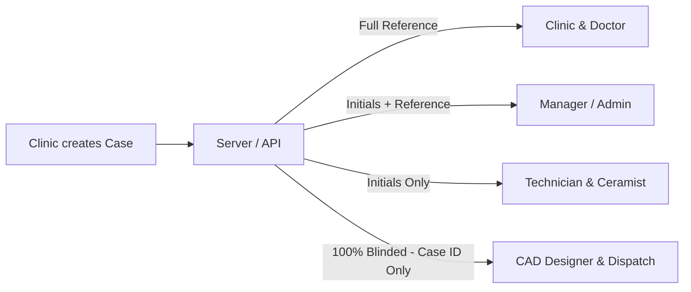

# Hesyra Portal: Numbering & Identification System Specification

This document provides a comprehensive technical overview and operational specification of the identification and numbering systems implemented across the **Hesyra Dental Portal**, including **Clinics / Doctors**, **Patients**, and **Case Tracking IDs**.

---

## 1. Doctor & Clinic Numbering System

Hesyra uniquely identifies dental practices and clinicians using two separate identifier schemes: a **geo-coded login code** and an **internal system identifier**.

### 1.1 Geo-Coded Clinic Code (`username`)
Every doctor/clinic account is assigned a regional, geo-coded identifier generated according to geographic location and onboarding sequence.

```
Format: [StateCode][CityCode][DocSerial]
Example: MH272
```

#### Breakdown of Components:
* **`StateCode` (2 uppercase letters):** Standard Indian postal/ISO state code.
  * *Examples:* `MH` (Maharashtra), `DL` (Delhi), `KA` (Karnataka), `GJ` (Gujarat), `TN` (Tamil Nadu).
* **`CityCode` (2 digits):** Regional / RTO district identifier.
  * *Examples:* `27` (Amravati), `01` (Mumbai Central), `12` (Pune), `14` (Pimpri-Chinchwad).
* **`DocSerial` (Sequential integer, 1+ digits):** Represents the $N$-th clinic/doctor registered in that specific city.
  * *Examples:* `1` (1st doctor), `2` (2nd doctor), `3` (3rd doctor).

#### Complete Examples:
| Code | State | City / District | Registration Sequence |
| :--- | :--- | :--- | :--- |
| **`MH272`** | Maharashtra (`MH`) | Amravati (`27`) | 2nd doctor in Amravati |
| **`MH273`** | Maharashtra (`MH`) | Amravati (`27`) | 3rd doctor in Amravati |
| **`MH274`** | Maharashtra (`MH`) | Amravati (`27`) | 4th doctor in Amravati |
| **`DL011`** | Delhi (`DL`) | North Delhi (`01`) | 1st doctor in North Delhi |

> **Authentication Note:** Doctors can sign in to the portal using either their registered email address or this geo-coded username.

---

### 1.2 Internal System Account ID (`customId`)
In addition to the human-readable clinic code, every account in the database receives an internal prefixed unique identifier:

```
Format: [ROLE_PREFIX]-[XXXX]
Examples: DOC-001, DOC-4821, TECH-001, CAD-001
```

* **Role Prefixes:**
  * `DOC-` : Clinic / Dentist (`clinic` role)
  * `TECH-` : Laboratory Technician (`technician` role)
  * `CAD-` : CAD Design Specialist (`cad_designer` role)
  * `CRM-` : Ceramic Finishing Specialist (`ceramist` role)
  * `DSP-` : Dispatch & Logistics (`dispatch` role)
  * `MGR-` : Lab Operations Manager (`manager` role)
  * `ADM-` : System Administrator (`admin` role)

---

## 2. Patient Identification & Privacy Architecture

### 2.1 Non-Identifying Patient Reference (HIPAA & DPDP Compliance)
Hesyra **deliberately avoids** auto-generating or storing persistent national/centralised patient identity numbers.

When initiating an Rx via **New Case**:
1. The clinician inputs a reference in the **`Patient ID / Reference`** field (`patientName`).
2. The UI guidelines prompt:
   > *"Enter any non-identifying code — 'JD-104', a chart number, or a nickname. Hesyra never stores real patient names, keeping your practice HIPAA/DPDP-compliant by default."*
3. Clinicians can enter:
   * Internal Clinic Chart Numbers (e.g., `CH-2026-881`)
   * Anonymized patient codes (e.g., `JD-104`)
   * Patient names/nicknames (e.g., `Arjun Mehta`)

---

### 2.2 Role-Based Privacy Blinding

To maintain privacy and clinical neutrality throughout production, patient data is blinded according to the accessing user's role:



* **Clinic / Ordering Doctor:** Full visibility into patient reference.
* **Technicians & Ceramists:** See 2-letter uppercase initials generated at query time:
  $$\text{Initials} = \text{patient.split(' ').map}(n \to n[0])\text{.join('').toUpperCase().slice}(0, 2)$$
  *(e.g., "Arjun Mehta" $\to$ `AM`).*
* **CAD Designers & Dispatch:** **Fully blinded.** Patient name, chart reference, initials, and clinic identity are withheld. Designers and dispatchers operate purely on the **Case ID**.

---

## 3. Case Tracking ID System (`customId`)

Every case submitted to Hesyra receives an atomically incremented, structured tracking ID generated by `generateCaseId(doctorId, caseType)`.

```
Format: [DocUsername][TypeCode]-[YYMM][MonthlyLabSeq]-[DocLifetimeSeq]
Example: MH272CB-26040003-007
```

### 3.1 Structure Breakdown

```
  MH272   CB  -  2604   0003  -  007
  |---|  |--|    |--|   |---|    |--|
    |      |       |      |        |
    |      |       |      |        +--> Doctor Lifetime Sequence (7th case by this doctor)
    |      |       |      +-----------> Global Lab Monthly Sequence (3rd case in the lab this month)
    |      |       +------------------> Year & Month (YYMM = April 2026)
    |      +--------------------------> 2-Letter Prosthesis / Case Type Code (Crown & Bridge)
    +---------------------------------> Doctor / Clinic Geo-Code (Maharashtra, Amravati, Doctor #2)
```

---

### 3.2 Prosthesis / Case Type Codes (`TypeCode`)

| Code | Prosthesis Category | Description |
| :---: | :--- | :--- |
| **`CB`** | Crown & Bridge (`crown_bridge`) | Zirconia, nano-hybrid ceramic, or resin crowns/bridges |
| **`SG`** | Surgical Guide (`surgical_guide`) | Implant surgical drill guides |
| **`SP`** | Splint (`splint`) | Occlusal splints & nightguards |
| **`RT`** | Retainer (`retainer`) | Post-orthodontic retainers (e.g. Hawley/clear) |
| **`AL`** | Clear Aligner (`aligner`) | Sequential thermoformed clear aligners |
| **`DN`** | Denture (`denture`) | Complete or partial PMMA dentures |
| **`VN`** | Veneer (`veneer`) | Aesthetic anterior laminate veneers |
| **`MD`** | 3D Model (`model`) | Diagnostic study models & working dies |
| **`DR`** | Draft (`draft`) | Saved unsubmitted case prescription |
| **`XX`** | Unknown / Custom | Fallback type |

---

### 3.3 Atomic Counter Mechanics

Sequencing numbers are atomically managed in the SQLite database via the `Counter` table to guarantee uniqueness across concurrent requests without race conditions:

1. **Global Monthly Counter (`month:YYMM`):**
   * Key format: `month:2604`
   * Increments with every case received lab-wide in that calendar month.
   * Formatted to 4 digits: `0001`, `0002`, `0003`, etc.
2. **Doctor Lifetime Counter (`doc:<doctorId>`):**
   * Key format: `doc:c2a74e50-...`
   * Tracks total cumulative cases placed by that individual clinic across its entire tenure.
   * Formatted to 3 digits: `001`, `002`, `007`, etc.

---

## 4. Summary Matrix

| Entity | Identifier Format | Primary Function | Example |
| :--- | :--- | :--- | :--- |
| **Clinic / Doctor** | `[State][City][Serial]` | Geo-coded account username, routing prefix | `MH272` |
| **System User** | `[ROLE]-[XXXX]` | Internal database account ID | `DOC-001` |
| **Patient** | Free-form code / initials | HIPAA/DPDP privacy reference & chart ID | `JD-104` (Blinded initials: `AM`) |
| **Case Tracking** | `[Doc][Type]-[YYMM][Seq]-[DocSeq]` | End-to-end lab workflow & tracking ID | `MH272CB-26040003-007` |
